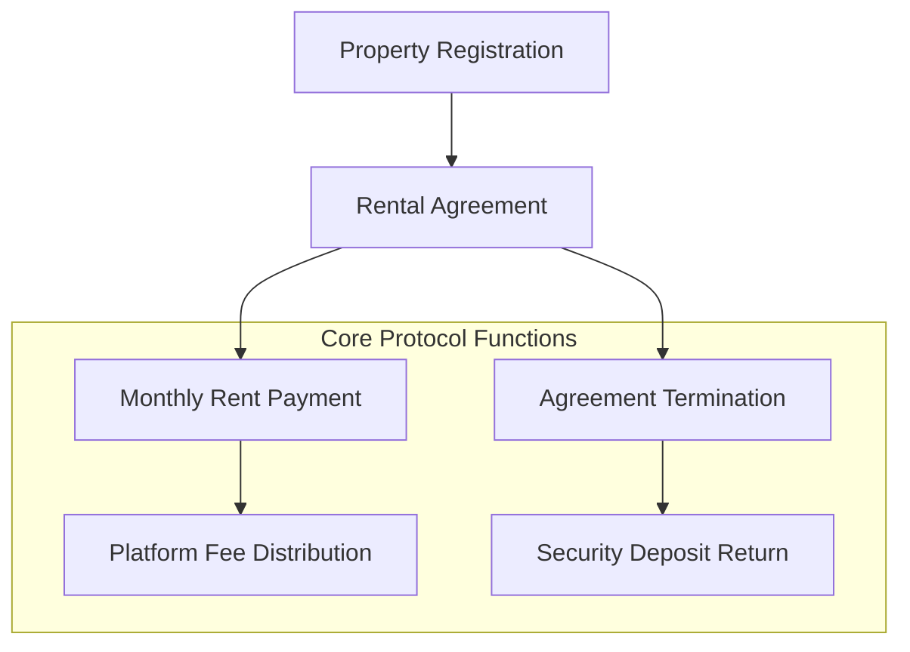

# Uma Rental Algorithm

## Overview

Uma is a decentralized rental protocol built on the Stacks blockchain, providing a secure, transparent, and efficient platform for property leasing. By leveraging smart contracts, Uma eliminates traditional intermediaries and reduces friction in the rental process.

### Key Features

- Trustless property listing and rental agreements
- Secure escrow and automated payment handling
- Flexible rental terms and conditions
- Low, transparent platform fees
- Immutable transaction and agreement records

## Architecture



## Getting Started

### Prerequisites

- Clarinet CLI
- Stacks wallet
- STX tokens for transactions

### Installation

1. Clone the repository
2. Install dependencies: `npm install`
3. Compile and deploy contracts using Clarinet

### Basic Usage

#### Register a Property

```clarity
(contract-call? .uma-rental-core 
  register-property
  "Modern City Apartment"  ;; Title
  "Spacious 2BR in downtown" ;; Description
  u2500000  ;; Monthly rate (2500 STX)
  u5000000  ;; Security deposit
)
```

#### Create Rental Agreement

```clarity
(contract-call? .uma-rental-core
  create-agreement
  u1  ;; Property ID
  u100  ;; Start block
  u1000 ;; End block
)
```

#### Pay Monthly Rent

```clarity
(contract-call? .uma-rental-core
  pay-monthly-rent
  u1  ;; Agreement ID
)
```

## Contract Functions

### Property Management
- `register-property`: List a new rental property
- `create-agreement`: Initiate a rental agreement

### Financial Operations
- `pay-monthly-rent`: Process monthly rent payment
- `terminate-agreement`: End rental agreement and return deposit

### Administrative
- `update-protocol-fee`: Adjust platform fee percentage
- `transfer-protocol-ownership`: Change protocol administrator

## Security Considerations

- Smart contract-based escrow for security deposits
- Immutable transaction records
- Transparent fee structure
- Built-in access controls

## Development

### Testing
Run tests using Clarinet:
```bash
clarinet test
```

### Local Development
1. Start Clarinet console: `clarinet console`
2. Deploy contracts
3. Interact via contract calls

## Limitations & Disclaimer

- Requires STX for transactions
- Dependent on Stacks blockchain availability
- Always review agreement terms carefully

## License

[MIT License]